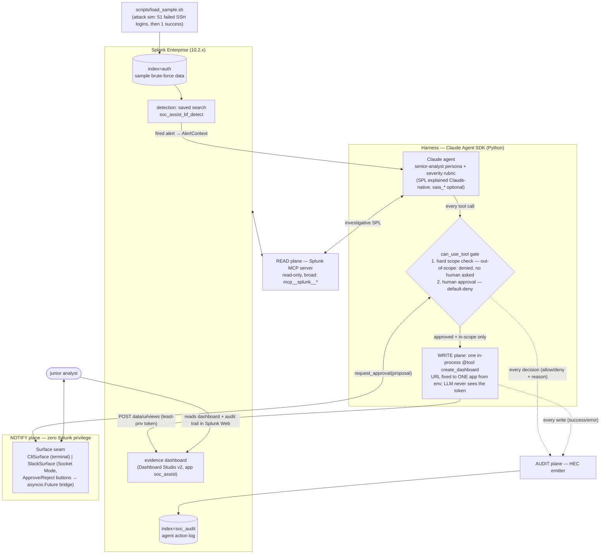

# Architecture

> The required deliverable — "an architecture diagram showing how it talks to
> Splunk, how AI is integrated, and the data flow" — lives here:
> [`architecture.svg`](architecture.svg) (rendered from
> [`architecture.mmd`](architecture.mmd), also shown inline below).

## The demo arc

```bash
scripts/load_sample.sh              # attack sim → index=auth
printf 'y\n' | python -m soc_assist.run --live
# detection fires → agent investigates (read-only) → rubric-cited verdict
# → gated, human-approved dashboard publish → URL + audit trail in Splunk
```

## Four planes, separated by privilege





- **READ** — native Splunk MCP, read-only, broad. The SDK consumes it as an external
  MCP client. Core tools are prefixed `splunk_` (e.g. `splunk_run_query`); the
  SPL-assistant `saia_*` tools are **optional** — the harness explains SPL
  Claude-native. Namespaced as `mcp__splunk__<tool>`, allowed via the
  `mcp__splunk__*` wildcard.
- **WRITE** — the *only* elevated capability. One in-process `@tool`
  (`create_dashboard`); the LLM never holds Splunk write credentials, it can only
  *invoke* the tool, and the tool's URL is built from operator config so it can
  physically POST to one app's `data/ui/views` and nowhere else. The deployment
  pairs it with a dedicated Splunk role that has **zero capabilities** and only
  that app's write ACL.
- **NOTIFY** — the `Surface` seam; Slack (Socket Mode — no inbound server) or the
  terminal. Zero Splunk privilege.
- **AUDIT** — every gate decision and every write, appended to a dedicated index
  over HEC; surfaced in its own dashboard. The watcher is watched.

### The gate (the security core)

Every tool call passes `can_use_tool`. Reads pass. For the write tool, **scope
beats approval**: arguments that try to retarget the write (extra args, path
traversal in the view name) are denied *before any human is asked*, so a
persuaded human cannot bless an escape; in-scope writes still require an explicit
yes, with anything else — timeout, EOF, ambiguity — denied by default. Even a
fully prompt-injected agent cannot exceed the one-app scope.
`python -m soc_assist.demo_gate` is the runnable proof.

## Claude Agent SDK mapping (Python, snake_case)

| Need | SDK primitive |
|---|---|
| Connect to the Splunk MCP server | `ClaudeAgentOptions(mcp_servers={"splunk": {"type": "http", "url": ..., "headers": ...}})` + `allowed_tools=["mcp__splunk__*"]` |
| Human-approval gate + hard scope check on writes | `can_use_tool` callback → `PermissionResultAllow` / `PermissionResultDeny`. The write tool is deliberately **not** in `allowed_tools` — pre-allowed tools bypass the callback |
| Custom Splunk REST write tool | `@tool` → `create_sdk_mcp_server()` → passed into `mcp_servers` |
| Multi-turn investigation + structured verdict | `ClaudeSDKClient` (investigate → JSON verdict → gated dashboard turn, one session) |
| No ambient config leakage | `setting_sources=[]` |

See [DESIGN.md](DESIGN.md) for the full design and rationale, and
[SPEC.md](SPEC.md) for the build ledger.
